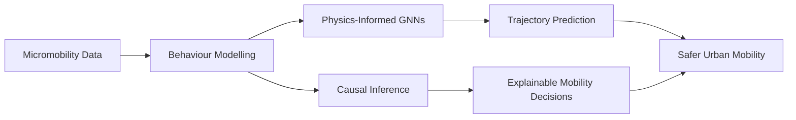

  

  <h1>Hi, I'm Rong Huang 👋</h1>
  
<strong>PhD Student in Transportation Engineering, Tongji University</strong>

  
Micromobility · Physics-Informed AI · Causal Inference · Graph Neural Networks

  

    
    
    
  

---

## About Me

I am a PhD student in Transportation Engineering at Tongji University. My research focuses on micromobility systems, microscopic behavioural modelling, causal inference, and physics-informed graph neural networks.

I hope to connect individual-level behavioural mechanisms with system-level traffic dynamics, and to build models that are both accurate and interpretable.

## Research Map

## Research Interests

| Area | Keywords |
| --- | --- |
| Micromobility | bicycles, e-bikes, e-scooters, mixed traffic |
| Machine Learning | graph neural networks, spatio-temporal modelling, world models |
| Causal AI | causal inference, explainability, behavioural mechanisms |
| Traffic Systems | microscopic flow, simulation, network performance |

## Current Work

- Physics-informed graph neural networks for bicycle trajectory prediction
- Mixed traffic interaction modelling for micromobility users and vehicles
- Simulation-based evaluation of urban traffic systems
- Behaviour-aware and interpretable learning models for mobility research

## Languages and Tools

  

  
  
  
  

## Selected Publications

- **R. Huang**, Y. Bai, H. Shi. *DyScene: Enhancing Physical Realism via Physics-Informed Graph Neural Networks for Bicycle Trajectories*. Transportation Research Board, 2026.
- **R. Huang**, Y. Bai. *Lateral Position Preference of Non-motorized Vehicles*. Cross-Strait Conference on Urban Transportation, 2025.
- **R. Huang**, Y. Bai, N. Wu. *Enterprises' Participation Preference toward Platooning Operation*. CICTP 2025.

## GitHub Snapshot

  
  

## Website

The static academic homepage in this repository is designed to work without a complicated Jekyll theme:

https://dora1288.github.io/huangrong/
